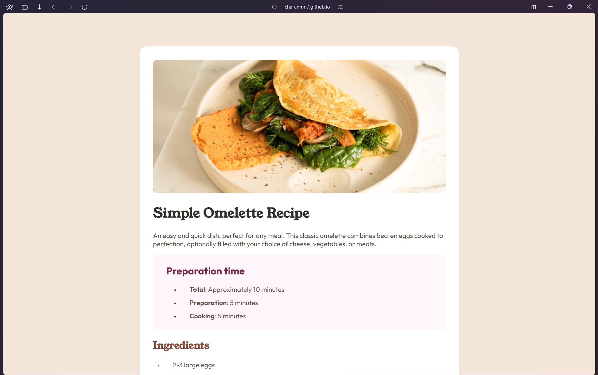

# Frontend Mentor - Recipe page solution

This is a solution to the [Recipe page challenge on Frontend Mentor](https://www.frontendmentor.io/challenges/recipe-page-KiTsR8QQKm). Frontend Mentor challenges help you improve your coding skills by building realistic projects. 

## Table of contents

- [Frontend Mentor - Recipe page solution](#frontend-mentor---recipe-page-solution)
  - [Table of contents](#table-of-contents)
  - [Overview](#overview)
    - [Screenshot](#screenshot)
    - [Links](#links)
  - [My process](#my-process)
    - [Built with](#built-with)
    - [What I learned](#what-i-learned)
  - [Author](#author)

## Overview

### Screenshot

### Links

- Solution URL: [Solution](https://github.com/CharanMN7/omelette-recipe)
- Live Site URL: [Live Site](https://charanmn7.github.io/omelette-recipe/)

## My process

### Built with

- Semantic HTML5 markup
- CSS

### What I learned

This challenge helped me revise the semantic HTML markup guidelines that I learnt a few months ago. It also made me google around to find ways to customize the bullets of the lists in page. And, I really loved the typography and color choice for the page, done by the Frontend Mentor. I'm slowly learning to cookup my own typography and color choices for good UI/UX.

## Author

- Website - [Charan](https://charanmn7.github.io/social-links/)
- Frontend Mentor - [@yourusername](https://www.frontendmentor.io/profile/CharanMN7)
- Twitter/X - [@yourusername](https://www.twitter.com/CharanMNX)
